Macrosystems EDDIE Module 7: Using Data to Improve Ecological Forecasts
================
Mary Lofton, Tadhg Moore, Quinn Thomas, Cayelan Carey
2023-12-18

## Purpose of this R Markdown

This R Markdown contains code to reproduce the basic functionality of
“Macrosystems EDDIE Module 7: Using Data to Improve Ecological
Forecasts” outside of R Shiny. The code can be used by students to
better understand what is happening “under the hood” of the Shiny app,
which can be found at the following link:  
<https://macrosystemseddie.shinyapps.io/module7/>.

Alternatively, students can complete this version of the module instead
of the Shiny app version.

## Summary

### Focal question for this module:

**How can we use data to improve ecological forecasts?**

To be useful for management, ecological forecasts need to be both
accurate enough for managers to be able to rely on them for
decision-making and include a representation of forecast uncertainty, so
managers can properly interpret the probability of future events. To
improve forecast accuracy, we can update forecasts with observational
data once they become available, a process known as **data
assimilation.** Recent improvements in environmental sensor technology
and an increase in the number of sensors deployed in ecosystems have
resulted in an increase in the availability of data for assimilation to
help develop and improve forecasts for natural resource management. In
this module, you will develop an autoregressive model of primary
productivity and use the model to generate forecasts. You will then
explore how assimilating data at different temporal frequencies (e.g.,
daily, weekly) and with different levels of observation uncertainty
affects forecast accuracy.

## Learning Outcomes

1.  Define data assimilation.  
2.  Generate an ecological forecast for primary productivity.  
3.  Describe how to assess ecological forecast accuracy.  
4.  Describe how data assimilation affects forecast accuracy and
    uncertainty.  
5.  Explain how updating models with data collected at different time
    scales (e.g., daily, weekly) and with different levels of associated
    uncertainty affects ecological forecasts.

## Key Concepts

### What is data assimilation?

Data assimilation is the process of updating models with data. In
ecological forecasting, data assimilation is the process of updating
ecological forecasting models with new environmental data as they become
available.

### How does the amount of uncertainty in model predictions and data affect the process of data assimilation?

The amount of uncertainty in model predictions and data determines how
much we adjust our forecasts based on new observations. For example, if
we observe a new data point and we have low observation uncertainty, our
forecast starting conditions will be adjusted to closely correspond to
the new observation. If we observe a new data point and we have high
observation uncertainty, our forecast starting conditions will not be
adjusted as much.

### How does the frequency of observations affect data assimilation?

More frequent observations allow us to update our forecast models more
often, potentially improving forecast accuracy.

## Overview

In this module, we will generate multiple one-day-ahead forecasts of
lake chlorophyll-a. First, we will generate forecasts that do not
assimilate any data. This will involve the following steps:

1.  Read in and visualize chlorophyll-a data from Lake Barco, FL, USA.  
2.  Explore autocorrelation of Lake Barco chlorophyll-a data.  
3.  Fit an autoregressive forecast model.  
4.  Specify a distribution of forecast **initial conditions** (starting
    conditions).
5.  Generate forecasts with no data assimilation.
6.  Assess forecast accuracy.

Next, we will explore the effect of **data assimilation** on forecast
accuracy by conducting two data assimilation experiments. First, we will
assimilate data at different temporal frequencies (e.g., daily
vs. weekly) and assess the effect on forecast accuracy. Second, we will
assimilate data with different levels of observation uncertainty (e.g.,
high vs. low observation uncertainty) and assess the effect on forecast
accuracy.

7.  Assimilate data at frequencies ranging from once a week to once a
    day.  
8.  Assess the effect of data assimilation frequency on forecast
    accuracy.  
9.  Assimilate data with different levels of observation uncertainty.  
10. Assess the effect of observation uncertainty on forecast accuracy.

Finally, you will be asked to summarize what you have learned about how
to use data to improve ecological forecasts, and explain how data
assimilation frequency and observation uncertainty are likely to affect
forecast accuracy.

There are a total of XX questions embedded throughout this module, many
of which parallel (and in some cases are identical to) questions in the
R Shiny app version of the module. Questions which are identical to
those in the Shiny app will be indicated with **(Shiny)**, while
questions unique to this RMarkdown will be indicated with **(Rmd)**.
Note that question numbers will differ between the RMarkdown and the
Shiny app, even if the question text is the same. Please see the module
rubric for possible points per question and confirm with your instructor
whether and how the module will be graded.

## Think About It!

**Q.1 (Shiny)** What is meant by the term ‘data assimilation’ in the
context of ecological forecasting?

**Answer Q.1**

**Q.2 (Shiny)** How do you think the process of integrating the most
recently observed data into models can improve forecasts?

**Answer Q.2**

## Set-up

We will install and load some packages and functions that are needed to
run the module code.

If you do not currently have the packages below downloaded for RStudio,
you will need to install them first using the `install.packages()`
function (uncomment the lines and install the packages).

We will also load some custom functions that are stored in the
`Rmd_functions.R` file using the `source()` function.

## 1. Read in and visualize data from Lake Barco, FL, USA

Lake Barco is one of the lake sites in the U.S. National Ecological
Observatory Network (NEON). Please refer to
<https://www.neonscience.org/field-sites/barc> to learn more about this
site.

**Q.3 (Shiny)** Use the website linked above to fill out information
about Lake Barco:

**Answer Q.3**

Four letter site identifier:  
Latitude:  
Longitude:  
Lake area (km2):  
Elevation (m):

### Chlorophyll-a in lakes

Chlorophyll-a concentrations are an indicator of algal (phytoplankton)
abundance and biomass in a lake. Phytoplankton are important primary
producers at the base of the lake food web, and are therefore necessary
for healthy lake ecosystem function. However, an overabundance of
phytoplankton can lead to harmful blooms.

Blooms compromise water quality via unsightly scums, clogging of filters
at water treatment plants, release of noxious taste and odor compounds,
and in some cases release of toxins that pose substantial risk to human
and animal health.

Forecasts of chlorophyll-a concentrations days to weeks into the future
can give water managers important information about the likelihood of a
bloom event. This permits pre-emptive management to prevent or mitigate
water quality concerns caused by blooms.

**Q.4 Why might a forecast of lake chlorophyll-a concentration days to
weeks into the future be a useful tool for water managers?**

**Answer Q.4**

Read in and view lake chlorophyll-a data.

We will rename the columns of our dataframe, and use the `cumsum()`
function to filter out several rows with NA chlorophyll-a values at the
beginning of our dataset. Here, the `cumsum()` function returns, at each
row, the cumulative number of non-NA chl-a values up to that row. This
allows us to filter out NA values at the beginning of the dataset,
because as soon as the first non-NA chl-a value is observed, the
`cumsum()` function will return a value greater than 0.

Finally, we will use the `mutate()` function to set any chl-a values
that are less than 0 due to sensor error to 0, as negative chl-a values
(representing negative phytoplankton) are not actually possible.

``` r
lake_data <- read_csv("./data/neon/BARC_chla_microgramsPerLiter.csv", show_col_types = FALSE) %>%
  rename(datetime = Date, chla = V1) %>%
  filter(cumsum(!is.na(chla)) > 0) %>%
  mutate(chla = ifelse(chla < 0, 0, chla))

head(lake_data)
```

    ## # A tibble: 6 × 2
    ##   datetime    chla
    ##   <date>     <dbl>
    ## 1 2017-10-20  1.15
    ## 2 2017-10-21  1.38
    ## 3 2017-10-22  1.55
    ## 4 2017-10-23  1.52
    ## 5 2017-10-24  1.47
    ## 6 2017-10-25  1.30

Plot a timeseries of chlorophyll-a observations at Lake Barco.

``` r
plot_chla_obs(lake_data)
```

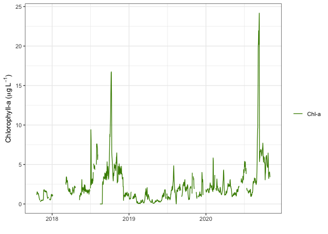<!-- -->

**Q.5 Describe how chlorophyll-a changes over time in Lake Barco. Do you
notice any patterns or trends?**

**Answer Q.5**

## 2. Explore autocorrelation of Lake Barco chlorophyll-a data.

## What is autocorrelation?

**Autocorrelation** is the correspondence between a value and previous
values of that variable which have been recently observed. For example,
mean daily air temperature over the course of a year exhibits
autocorrelation, as today’s mean daily air temperature is related to the
mean daily air temperatures observed over the days and weeks prior to
today.

The **incredibly useful** thing about autocorrelation from a forecasting
perspective is that it allows us to use *previous or current
observations* of a variable to predict *future values* of that
variable - excellent!

## What is a lag?

A **lag** is a particular amount of time that has passed between when we
observe a value we are using as an explanatory, or independent,
variable, and when we observe a value that we are trying to predict. For
example, if you use today’s air temperature to predict tomorrow’s air
temperature, you are using a 1-day lag of air temperature to predict
tomorrow’s air temperature.

You could also use a 2-day lag of air temperature (that would be the air
temperature observed yesterday), or a 3-day lag, 4-day lag, and so on…..
or some combination of all of those lags, to predict tomorrow’s air
temperature.

In general, stronger relationships among lags of a variable leads to
higher **autocorrelation** in a timeseries of that variable.

**Q.6 Explain, in your own words, how autocorrelation in a variable can
help forecasters make predictions of the future.**

**Answer Q.6**

Let’s explore lags and autocorrelation in chl-a data at Lake Barco.

First, we need to do some data wrangling. We will `filter()` our dataset
to only include data that are observed prior to our forecast date, which
is 2020-09-25. These are the data we will eventually use to fit our
forecast model.

We will also linearly interpolate missing values in our chlorophyll-a
data using the `na.approx()` function, and create a column of 1-day
lagged values of chlorophyll-a using the `lag()` function.

Finally, we will double-check that we have no missing values in our
dataset by using `complete.cases()` to eliminate rows with NA values.
This is important because we cannot have NA values when we fit our
forecasting model to our data later on.

``` r
forecast_start_date <- "2020-09-25"

autocorrelation_data <- lake_data %>%
    filter(datetime < forecast_start_date) %>%
    mutate(chla = na.approx(chla, na.rm = F)) %>% 
    mutate(chla_lag = lag(chla)) %>%
    filter(complete.cases(.))

head(autocorrelation_data)
```

    ## # A tibble: 6 × 3
    ##   datetime    chla chla_lag
    ##   <date>     <dbl>    <dbl>
    ## 1 2017-10-21  1.38     1.15
    ## 2 2017-10-22  1.55     1.38
    ## 3 2017-10-23  1.52     1.55
    ## 4 2017-10-24  1.47     1.52
    ## 5 2017-10-25  1.30     1.47
    ## 6 2017-10-26  1.24     1.30

Next, we will create an example plot to illustrate the concept of a
**lagged variable**. To make it easier to see the 1-day lag in
chlorophyll-a on the figure, we will only plot data from the last four
months in 2018.

``` r
plot_data <- autocorrelation_data %>%
  filter(datetime > "2018-09-01" & datetime < "2018-12-31")

plot_chla_lag(plot_data)
```

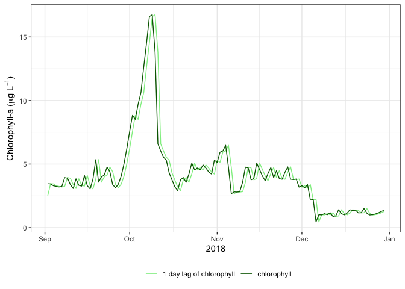<!-- --> **Q.7
Describe what you observe on the timeseries figure above. How do the two
lines plotted on the timeseries (chlorophyll and 1 day lag of
chlorophyll) relate to each other?**

**Answer Q.7**

To visualize the relationship between chlorophyll and a 1 day lag of
chlorophyll in a different way, we will also plot these two timeseries
on a scatterplot. The dashed diagonal line represents the 1:1 line. The
closer the points fall to this line, the stronger of the linear
relationship between the independent variable (x axis) and the dependent
variable (y axis).

Note that now, we are plotting the complete model fitting dataset
(2017-10-21 to 2020-09-25).

``` r
ggplot(data = autocorrelation_data, aes(x = chla_lag, y = chla))+
  geom_point()+
  xlab(expression(paste("1 day lag of chlorophyll-a (",mu,g,~L^-1,")")))+
  ylab(expression(paste("chlorophyll-a (",mu,g,~L^-1,")")))+
  geom_abline(slope = 1, intercept = 0, linetype = 2)+
  theme_bw()
```

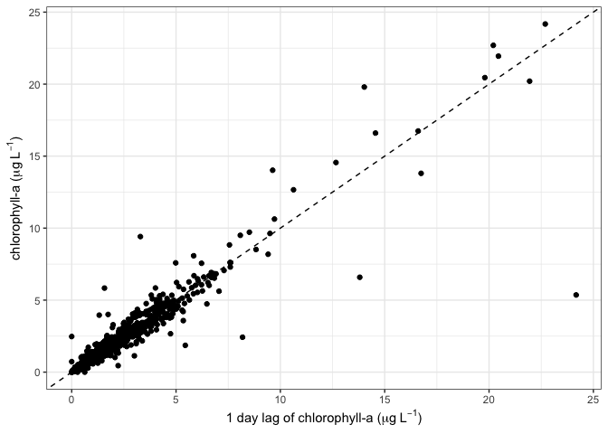<!-- --> **Q.8
Describe what you observe on the scatterplot figure above. Do you think
the Lake Barco chlorophyll-a data exhibit autocorrelation? Why or why
not?**

**Answer Q.8**

In addition to visualizing autocorrelation, we can also calculate it.
The autocorrelation between chlorophyll-a ($Chla$) and a 1-day lag of
chlorophyll-a ($ChlaLag$) is represented by the following equation:

$$Autocorrelation = \frac {\sum_{t = 2}^{T} (
Chla - \overline{Chla}) * (
ChlaLag - \overline{Chla})}{\sum_{t = 1}^{T} (
Chla - \overline{Chla})^2}$$

where $T$ is the timeseries of observations in the timeseries and $t$
represents which observation in that timeseries we are starting with
(either the 1st or 2nd observation). Recall that the capital sigma
$(\sum)$ indicates a sum and the overline $(\overline{Chla})$ indicates
the mean.

The closer the autocorrelation is to 1, the stronger the autocorrelation
between the variable and its lag.

We can calculate autocorrelation in code. Note that in the following
calculation, the `[-1]` eliminates the first element of
`autocorrelation_data$chla` or `autocorrelation_data$chla_lag` vectors,
following the $t=2$ specification for the $\sum_{t = 2}^{T}$ function in
the numerator of the autocorrelation equation above.

``` r
autocorrelation_lag1 = round(sum((autocorrelation_data$chla[-1] - mean(autocorrelation_data$chla[-1]))*(autocorrelation_data$chla_lag[-1] - mean(autocorrelation_data$chla[-1])))/sum((autocorrelation_data$chla - mean(autocorrelation_data$chla))^2),3)

autocorrelation_lag1
```

    ## [1] 0.932

**Q.9 Interpret the value of `autocorrelation_lag1`; does this value
indicate low or high autocorrelation between chlorophyll-a and a 1-day
lag of chlorophyll-a?**

**Answer Q.9**

Next, we can calculate and plot the autocorrelation values for many
different lags of our chlorophyll-a data. Rather than doing this
calculation step-by-step, we can use the `acf()` function to calculate
the autocorrelation for many lags, and then plot them below.

``` r
acf_list <- acf(autocorrelation_data$chla, plot = FALSE)

acf_plot_data <- tibble(Lag = acf_list$lag,
                        ACF = round(acf_list$acf, 2))

ggplot(data = acf_plot_data, aes(x = Lag, y = ACF))+
  geom_bar(stat = "identity")+
  xlab("Lag in days")+
  ylab("Autocorrelation")+
  theme_bw()
```

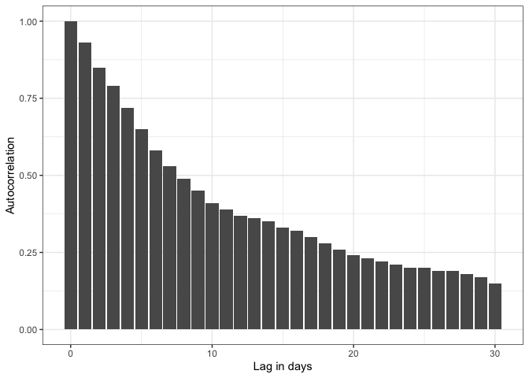<!-- --> **Q.10
Describe how autocorrelation changes as the lag in days increases. Why
do you think this pattern occurs?**

**Answer Q.10**

**Q.11 Imagine you are asked to develop a forecasting model that uses
lagged values of chlorophyll-a to predict future chlorophyll-a.
Examining the autocorrelation plot above, how many lags of chlorophyll-a
would you include in your forecasting model? Provide your answer in days
(e.g., I would include up to a 3-day lag) and explain your reasoning.**

**Answer Q. 11**

As you may have discovered while answering Q.11, it can be difficult to
decide exactly how many lags to include in a forecasting model.
Fortunately, forecasters have developed tools to help make this
decision. One such tool is the **partial autocorrelation function**, or
**PACF**. This function calculates the autocorrelation of a particular
lag *while removing* the effects of indirect correlations with other
lags.

To explain another way: the **autocorrelation** of chlorophyll-a and the
7-day lag of chlorophyll-a is affected by the autocorrelation of
chlorophyll-a with the 1-day lag, the 2-day lag, the 3-day lag, and so
on…. as well as the relationship of the 7-day lag to the 1-day lag, the
2-day lag, the 3-day lag, and so on…..

The PACF avoids this problem. You can think of it as only measuring the
effect of one particular set of lagged values (e.g., the 5-day lagged
values), while accounting for (and thereby removing the influence of)
all other lags.

To calculate the PACF, we can use the same `acf()` function, while
adding the argument `type = c("partial")` to indicate that we’d like to
calculate the partial autocorrelation function.

``` r
pacf_list <- acf(autocorrelation_data$chla, type = c("partial"), plot = FALSE)

pacf_plot_data <- tibble(Lag = pacf_list$lag,
                         Partial_ACF = round(pacf_list$acf, 2))
head(pacf_plot_data)
```

    ## # A tibble: 6 × 2
    ##           Lag Partial_ACF
    ##   <dbl[,1,1]> <dbl[,1,1]>
    ## 1         1 …      0.93 …
    ## 2         2 …     -0.11 …
    ## 3         3 …      0.07 …
    ## 4         4 …     -0.08 …
    ## 5         5 …     -0.05 …
    ## 6         6 …     -0.04 …

Now, we can plot the PACF.

``` r
ggplot(data = pacf_plot_data, aes(x = Lag, y = Partial_ACF))+
  geom_bar(stat = "identity")+
  xlab("Lag in days")+
  ylab("Partial autocorrelation")+
  theme_bw()
```

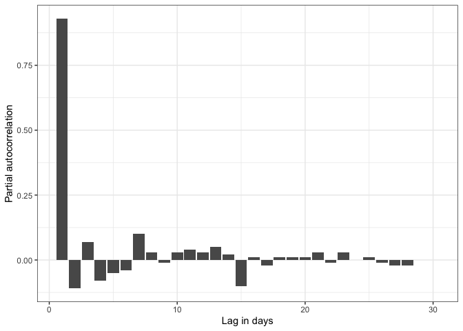<!-- --> **Q.12
Examine the PACF plot. Which lag contributes the most to autocorrelation
in the Lake Barco chlorophyll-a data? Explain how you know.**

**Answer Q. 11**

**Q.13 Once again, imagine you are asked to develop a forecasting model
that uses lagged values of chlorophyll-a to predict future
chlorophyll-a. Examining the PACF plot above, how many lags of
chlorophyll-a would you include in your forecasting model? Provide your
answer in days (e.g., I would include up to a 3-day lag) and explain
your reasoning.**

**Answer Q. 13**

**Q.14 Did the number of lags you chose to include in your forecasting
model change from Q.11 to Q.13? Why or why not?**

**Answer Q. 14**

## 3. Fit an autoregressive forecast model.

### What is an autoregressive model?

An **autoregressive model** uses past and/or current values of a
variable to predict future values. In our case, we are interested in
using past and current values of lake chlorophyll-a to predict future
chlorophyll-a.

Today, we will fit a simple form of an autoregressive, or AR model,
which uses yesterday’s chlorophyll-a observation (so, a 1-day lag) to
predict today’s observation. This model can be written as:

$$Chla_{t} = \beta_0 + \beta_1 * (Chla_{t-1} - \overline{Chla}) + \overline{Chla}$$
where $Chla$ is our timeseries of chlorophyll-a data, $\beta_0$ is the
intercept parameter, $\beta_1$ is the coefficient on the 1-day lag of
chlorophyll-a, and $\overline{Chla}$ is the mean of the chlorophyll-a
timeseries.

Let’s fit this model to our data!

``` r
model_data <- autocorrelation_data 
```

Next, to fit our model, we will use the `ar.ols()` function, which fits
an autoregressive time series model to data by ordinary least squares.

While it’s possible that including additional lags besides a 1-day lag
might improve our predictions, for today, we will keep it simple and
just use a 1-day lag. We will specify this by adding the `order.max = 1`
argument to our function.

In addition, we will specify:

1.  `aic = FALSE` because we know we only want to use the first lag, we
    don’t need to use the AIC, or Akaike Information Criterion, to help
    us choose how many lags to include
2.  `intercept = TRUE` we do want to fit an intercept term
3.  `demean = TRUE` we do want to subtract the mean

``` r
ar_model <- ar.ols(model_data$chla, order.max = 1, aic = FALSE,
                     intercept = TRUE, demean = TRUE)
```

Next, let’s extract our model parameters and have a look at them.

First, $\beta_0$, the intercept:

``` r
intercept = c(ar_model$x.intercept)
intercept
```

    ## [1] 0.004621037

Next, $\beta_1$, the 1-day lag coefficient:

``` r
ar1 = c(ar_model$ar)
ar1
```

    ## [1] 0.9354431

Then, the (log-transformed) mean of chlorophyll-a:

``` r
chla_mean = c(ar_model$x.mean)
chla_mean
```

    ## [1] 2.173594

And finally, because there is uncertainty associated with both our data
and the process of fitting a model to data, we can look at the standard
errors of each of these parameters:

``` r
params_se <- ar_model$asy.se.coef
params_se
```

    ## $x.mean
    ## [1] 0.02544425
    ## 
    ## $ar
    ## [1] 0.01095287

We will use these standard error values to account for uncertainty in
our parameters when we make chlorophyll-a forecasts.

**Q.15 Explain, in your own words, how the autoregressive model you have
just fitted predicts chlorophyll-a.**

**Answer Q. 15**

### How can we assess model fit?

Before we use this model for forecasting, it is a good idea to see how
well it fits our data. We will use three methods for doing this:

1.  Visual observation of model predictions vs. observations. This is a
    simple but effective method. The closer your model predictions fall
    to your observations, the better the model fit.
2.  **Bias**: Bias is the mean difference between model predictions and
    observations. The smaller the absolute value of the bias, the better
    your model fit.
3.  **Root mean square error (RMSE)**: RMSE is the mean sum of squared
    errors (differences between predictions and observations), and can
    be calculated as:

$$RMSE = \sqrt{\frac{\sum_{i=1}^{N}(Predicted_i - Observed_i)^2}{N}}$$
The closer the RMSE is to 0, the better your model fit.

First, let’s use our fitted model to generate predictions.

``` r
mod <- intercept + ar1 * (model_data$chla - chla_mean) + chla_mean
```

Next, we will creat a data frame for plotting and exponentiate the model
predictions using `exp()`. Exponentiation reverses the
log-transformation and is needed before we can compare our predictions
to data.

``` r
model_fit_plot_data <- tibble(date = model_data$datetime,
                              chla = model_data$chla,
                              model = mod)
```

Now, we can assess our model visually. We will plot the model
predictions and observations.

``` r
plot_mod_predictions_chla(model_fit_plot_data)
```

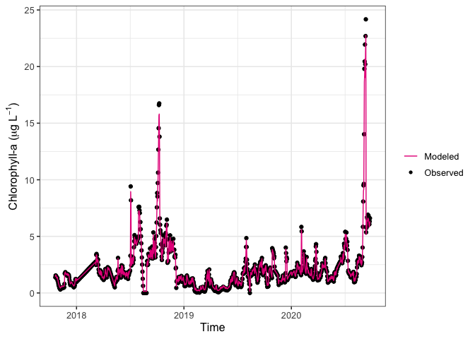<!-- -->

**Q.16 Use the plot above to assess the model fit to data. How well do
the predictions match the observations?**

**Answer Q. 16**

Next, we will calculate bias. The units of bias are the same as the
predicted variable (in our case, $\mu g L^{-1}$).

``` r
bias <- mean(mod - model_data$chla, na.rm = TRUE) 
bias
```

    ## [1] 0.004621037

**Q.17 Use the calculated bias to assess the model fit to data. How good
is the model fit? Explain your reasoning.**

**Answer Q. 17**

Finally, we will calculate RMSE. The units of RMSE are also the same as
the predicted variable.

``` r
rmse <- round(sqrt(mean((mod - model_data$chla)^2, na.rm = TRUE)), 2)
rmse
```

    ## [1] 0.15

**Q.18 Use the calculated RMSE to assess the model fit to data. How good
is the model fit? Explain your reasoning.**

**Answer Q. 18**

We will also save the log-transformed **residuals**, which are the
differences between model predictions and observations. We will need
these values later on to account for **process uncertainty**, or
uncertainty due to the structure of our model, in our forecasts.

``` r
residuals <- mod - model_data$chla
```

## 4. Specify a distribution of forecast **initial conditions** (starting conditions).

**Initial conditions** are the starting conditions of your model when
you generate a forecast. **Initial conditions uncertainty** refers to
uncertainty arising because the initial conditions are not precisely
known or because the calculations cannot be performed with the precise
initial conditions.

Even though we have measurements of chlorophyll-a from our lake, we know
that chlorophyll-a varies throughout the day so this measurement might
not capture exactly the chlorophyll-a in our lake at this time.
Additionally, there may be observation error in our chlorophyll-a
measurements.

To account for initial conditions uncertainty we can generate a
distribution around the initial condition of chlorophyll-a and then run
our model with slightly different initial conditions.

So far, we have been working with daily mean chlorophyll-a values from
Lake Barco.

Now, we will use some high-frequency (5-minute) chlorophyll-a data from
our lake to estimate initial conditions uncertainty.

``` r
high_frequency_data <- read_csv("./data/BARC_chla_microgramsPerLiter_highFrequency.csv", show_col_types = FALSE) %>%
  mutate(date = date(datetime),
         time = hms::as_hms(datetime)) %>%
  filter(date >= "2019-10-09" & date <= "2019-10-12")
```

First, we can look at variability in this 5-minute data over the course
of a day to get a visual understanding of the daily variability in
chlorophyll-a. Each colored line in the plot below represents a
different day of chl-a data from midnight to midnight. For ease of
visualization, we will only look at data from 2019-10-09 to 2019-10-12.

``` r
ggplot(data = high_frequency_data)+
  geom_line(aes(x = time, y = chla, group = date, color = as.factor(date)))+
  theme_bw()+
  labs(color = "Date")+
  xlab("Hour of day")+
  ylab("Chlorophyll-a (ug/L)")
```

<!-- -->

**Q.XX** Examine the plot of high-frequency chlorophyll-a data. How
variable is chlorophyll-a over the course of a day?

**Answer Q.XX**

**Q.XX** How do you think daily variability in chlorophyll-a data
affects the initial conditions uncertainty in our model?

**Answer Q.XX**

Next, we will calculate the mean daily standard deviation of chl-a
measurements (`ic_sd`), which we will use to estimate uncertainty in our
initial conditions.

``` r
ic_sd_dataframe <- high_frequency_data %>%
  group_by(date) %>%
  summarize(daily_sd_chla = sd(chla, na.rm = TRUE))
  
ic_sd <- mean(ic_sd_dataframe$daily_sd_chla, na.rm = TRUE)
```

Finally, we can generate a distribution of initial conditions for your
forecast using the current chlorophyll-a (`curr_chla`) and a standard
deviation in units of log(ug/L) calculated from high-frequency data from
Lake Barco (`ic_sd`).

To do this, we will use the `rnorm()` function, which takes `n` draws
from a normal distribution with a `mean` and `sd` specified as arguments
to the function.

``` r
curr_chla <- lake_data %>%
  filter(datetime == forecast_start_date) %>%
  pull(chla)

ic_distribution <- rnorm(n = 1000, mean = curr_chla, sd = ic_sd)
```

Plot the distribution around your initial condition.

``` r
plot_ic_dist(curr_chla, ic_distribution)
```

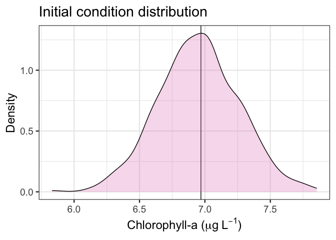<!-- -->

## 5. Generate one-day-ahead forecasts with no data assimilation.

Here we will generate a series of **1-day-ahead forecasts**. These
forecasts are generated once per day, and each day a prediction is made
for tomorrow. We will “give” the forecast model a chlorophyll-a
observation from Lake Barco that will be used as the initial condition
for the first forecast. But after that, we will not provide any
additional observations for additional forecasts. This could happen if,
for example, a sensor malfunctioned and you were unable to collect data,
or if you did not have a high-frequency sensor and were only able to
collect 1-2 observations per month. In the absence of additional
observations, the daily forecast model will simply use yesterday’s
forecast as the initial condition for today’s forecast.

First, we will decide how many days we would like to forecast

``` r
days_to_forecast = 10
```

Then we will create a date vector of our forecast start dates, based on
how many days we would like to forecast.

``` r
forecast_dates <- seq.Date(from = as.Date(forecast_start_date), to = as.Date(forecast_start_date) + days_to_forecast, by = 'days')
```

Next, we need to specify how often we want the forecast model to
assimilate data. For this first series of forecasts, we want to see what
happens when no data is assimilated during the forecast period (which is
10 days). So, we will set the `chla_assimilation_frequency` to 11 days,
ensuring that no data will be assimilated during the forecast period.

``` r
chla_assimilation_frequency = 11
```

Just before we run the forecast, we need to format our lake data to play
nicely with our forecasting function. First, we will create a vector
that we will use as an index to be sure that we only provide the model
with the chlorophyll-a data that we want to assimilate (in this case,
only the observation on the first day of the forecast period will be
provided as the initial condition for the forecast). Then, we will
manipulate our lake data to create a `forecast_data` dataframe.

``` r
  chla_assimilation_dates <- forecast_dates[seq(1, length(forecast_dates), chla_assimilation_frequency)]
  
  forecast_data <- lake_data %>%
    select(datetime, chla) %>%
    mutate(datetime = as.Date(datetime)) %>%
    filter(datetime %in% forecast_dates) %>%
    mutate(chla = ifelse(datetime %in% chla_assimilation_dates,chla,NA)) 
```

#### Run the forecast!!

For convenience, we’ll use a custom function to do this. If you’d like
to learn more about what is “under the hood” of this custom functions to
apply these concepts to your own research, you can find the source code
for it in the `Rmd_functions.R` script associated with this teaching
module.

The arguments to our custum `run_forecasts()` function are as follows:

1.  `n_en` is the number of ensemble members we want to simulate
2.  `start` is the start date of the forecast
3.  `stop` is the stop date of the forecast
4.  `forecast_data` is the data provided to generate the series of
    forecasts
5.  `ic_sd` is the standard deviation used to calculate initial
    conditions unncertainty
6.  `ic` is the initial condition for the forecast
7.  `model` is the R object containing the fitted autoregressive
    forecast model
8.  `residuals` are the residuals calculated by comparing the fitted
    model to data; used to calculate process uncertainty for forecasts

``` r
forecasts = run_forecasts(n_en = 200, # number of ensemble members
                          start = forecast_start_date, # start date 
                          stop = last(forecast_dates), # stop date
                          forecast_data = forecast_data, # file of observations
                          ic_sd = ic_sd, # sd of observations
                          ic = curr_chla, # initial condition
                          model = ar_model, # forecast model
                          residuals = residuals) # residuals from model fit
#plot forecast output
plot_chla(est_out = forecasts, lake_data = lake_data, obs_file = forecast_data, start = forecast_start_date, stop = last(forecast_dates), n_en = 200) 
```

    ## Warning: Removed 200 rows containing non-finite values (`stat_ydensity()`).

    ## Warning: Removed 2000 rows containing missing values (`geom_point()`).

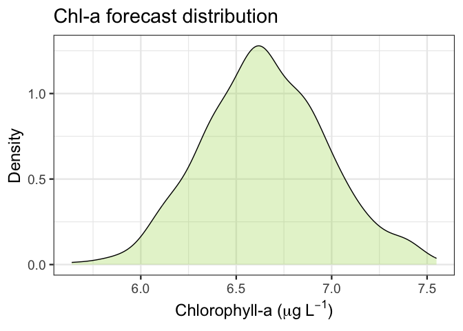<!-- --> Questions
for students: How does forecast uncertainty change throughout the
forecast period? Why is the predicted chl-a in the forecast decreasing
over time (refer to value of AR coefficient in model)? Visual assessment
of forecast fit.

## 6. Assess forecast accuracy.

Ask students to interpret pred vs obs plot.  
Ask students to interpret forecast assessment metrics (bias and RMSE).

``` r
#assess forecast
pred_v_obs_chla(forecasts = forecasts, lake_data = lake_data)
```

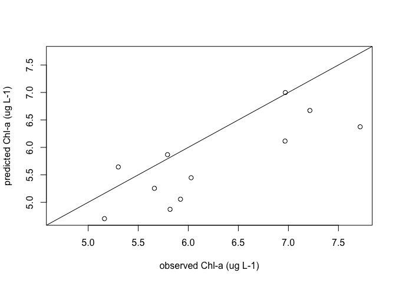<!-- -->

``` r
forecast = apply(forecasts$Y_pred[1,,] , 1, FUN = mean)

#limit obs to forecast dates
  forecast_obs <- lake_data %>%
    mutate(datetime = as.Date(datetime)) %>%
    filter(datetime %in% forecasts$dates) 
  
#calculate bias
err <- mean(forecast - forecast_obs$chla, na.rm = TRUE) 
#calculate RMSE
rmse <- sqrt(mean((forecast_obs$chla - forecast)^2, na.rm = TRUE))
```

## 7. Assimilate data at frequencies ranging from once a week to once a day.

Now we will conduct an experiment to address the following question: if
we had more frequent observations available to update our forecast
initial conditions, how would that affect our forecast accuracy? To
complete this experiment, we will generate forecasts while assimilating
observations at different temporal frequencies, ranging from once a week
to every day. Then, we will compare whether and how forecasts accuracy
changes when we have infrequent (e.g., weekly) vs. frequent (e.g.,
daily) to update our forecast initial conditions.

Explain for-loop structure: looping through
chla_assimilation_frequencies.  
What student questions should be included here, or should this be
combined with the next section?

``` r
#set forecast horizon in days
forecast_horizon = 10

#format observation data file depending on selected frequency of data assimilation
forecast_dates <- seq.Date(from = as.Date(forecast_start_date), to = as.Date(forecast_start_date) + forecast_horizon, by = 'days')

#define chlorophyll-a assimilation frequency vector - once a week to once a day
chla_assimilation_frequencies = c(10:1)

#make empty list for DA frequency experiment output
da_frequency_experiment_output <- list()

for(i in 1:length(chla_assimilation_frequencies)){
  
#create forecast data dataframe
  a <- c(1:forecast_horizon)
  b1 <- a[seq(1, length(a), chla_assimilation_frequencies[i])]
  
  forecast_data <- lake_data %>%
    select(datetime, chla) %>%
    mutate(datetime = as.Date(datetime)) %>%
    filter(datetime %in% forecast_dates) %>%
    mutate(rownum = row_number(datetime)) %>%
    mutate(chla = ifelse(rownum %in% b1,chla,NA)) %>%
    select(-rownum)


n_en = 200 # how many ensemble members 
#run the forecast!
da_frequency_experiment_output[[i]] = run_forecasts(n_en = 200, # number of ensemble members
                          start = forecast_start_date, # start date 
                          stop = last(forecast_dates), # stop date
                          forecast_data = forecast_data, # file of observations
                          ic_sd = ic_sd, # sd of observations
                          ic = curr_chla, # initial condition
                          model = ar_model, # forecast model
                          residuals = residuals) # residuals from model fit

names(da_frequency_experiment_output)[[i]] <- paste0(chla_assimilation_frequencies[i],"_days")

}
```

## 8. Assess the effect of data assimilation frequency on forecast accuracy.

Now that we have completed our data assimilation frequency experiment,
we need to assess the results

``` r
#plot and assess weekly DA
#plot forecast output
plot_chla(est_out = da_frequency_experiment_output[[4]], lake_data = lake_data, obs_file = da_frequency_experiment_output[[4]]$obs_file, start = forecast_start_date, stop = last(forecast_dates), n_en = n_en)
```

    ## Warning: Removed 200 rows containing non-finite values (`stat_ydensity()`).

    ## Warning: Removed 1800 rows containing missing values (`geom_point()`).

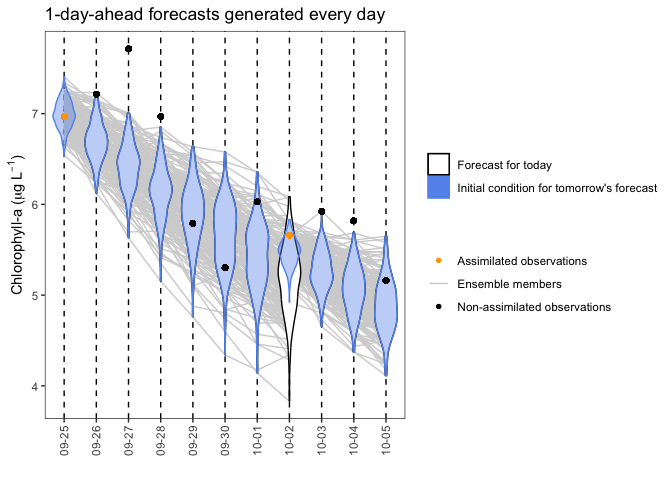<!-- -->

``` r
#assess forecast
pred_v_obs_chla(forecasts = da_frequency_experiment_output[[4]], lake_data = lake_data)
```

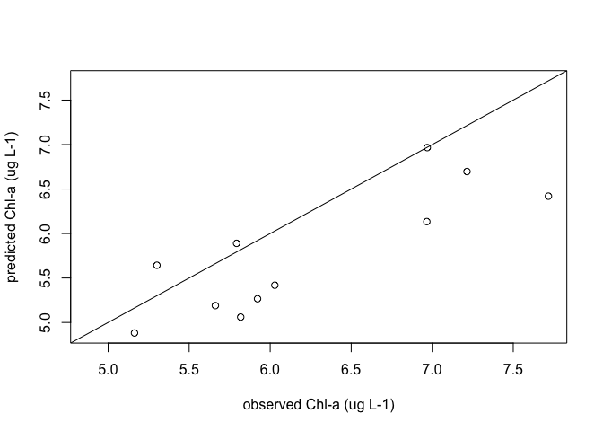<!-- -->

``` r
forecast = apply(da_frequency_experiment_output[[4]]$Y_pred[1,,] , 1, FUN = mean)

#limit obs to forecast dates
  forecast_obs <- lake_data %>%
    mutate(datetime = as.Date(datetime)) %>%
    filter(datetime %in% da_frequency_experiment_output[[4]]$dates) 
  
#calculate bias
err <- mean(forecast - forecast_obs$chla, na.rm = TRUE) 
#calculate RMSE
rmse <- sqrt(mean((forecast_obs$chla - forecast)^2, na.rm = TRUE))

#plot and assess daily DA
#plot forecast output
plot_chla(est_out = da_frequency_experiment_output[[7]], lake_data = lake_data, obs_file = da_frequency_experiment_output[[7]]$obs_file, start = forecast_start_date, stop = last(forecast_dates), n_en = n_en)
```

    ## Warning: Removed 200 rows containing non-finite values (`stat_ydensity()`).

    ## Warning: Removed 1600 rows containing missing values (`geom_point()`).

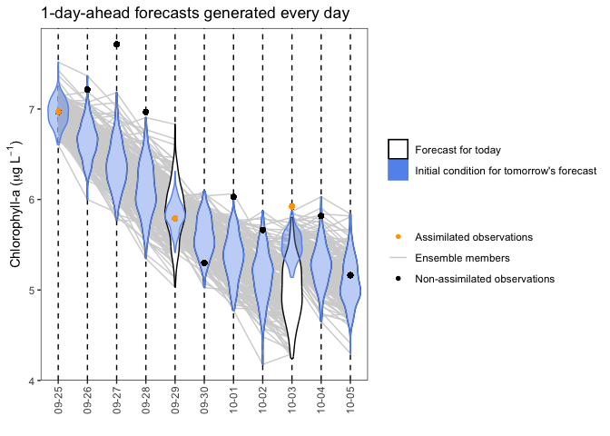<!-- -->

``` r
#assess forecast
pred_v_obs_chla(forecasts = da_frequency_experiment_output[[7]], lake_data = lake_data)
```

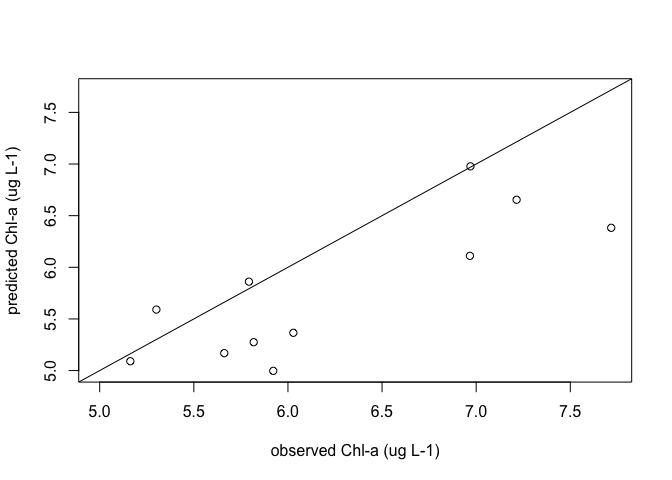<!-- -->

``` r
forecast = apply(da_frequency_experiment_output[[7]]$Y_pred[1,,] , 1, FUN = mean)

#limit obs to forecast dates
  forecast_obs <- lake_data %>%
    mutate(datetime = as.Date(datetime)) %>%
    filter(datetime %in% da_frequency_experiment_output[[7]]$dates) 
  
#calculate bias
err <- mean(forecast - forecast_obs$chla, na.rm = TRUE) 
#calculate RMSE
rmse <- sqrt(mean((forecast_obs$chla - forecast)^2, na.rm = TRUE))

#plot and assess daily DA
#plot forecast output
plot_chla(est_out = da_frequency_experiment_output[[10]], lake_data = lake_data, obs_file = da_frequency_experiment_output[[10]]$obs_file, start = forecast_start_date, stop = last(forecast_dates), n_en = n_en)
```

    ## Warning: Removed 200 rows containing non-finite values (`stat_ydensity()`).

    ## Warning: Removed 200 rows containing missing values (`geom_point()`).

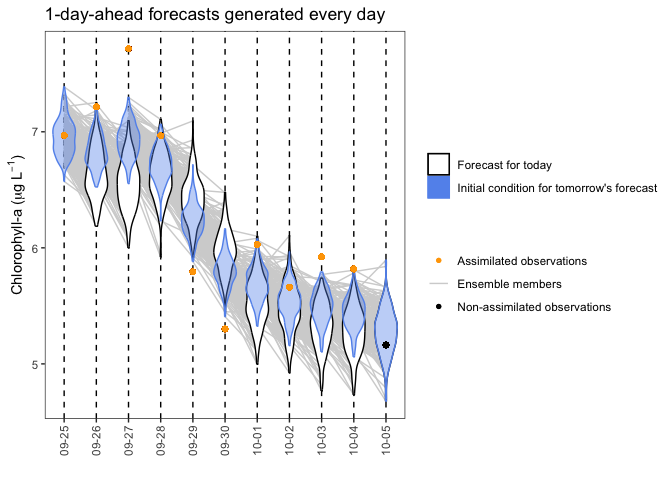<!-- -->

``` r
#assess forecast
pred_v_obs_chla(forecasts = da_frequency_experiment_output[[10]], lake_data = lake_data)
```

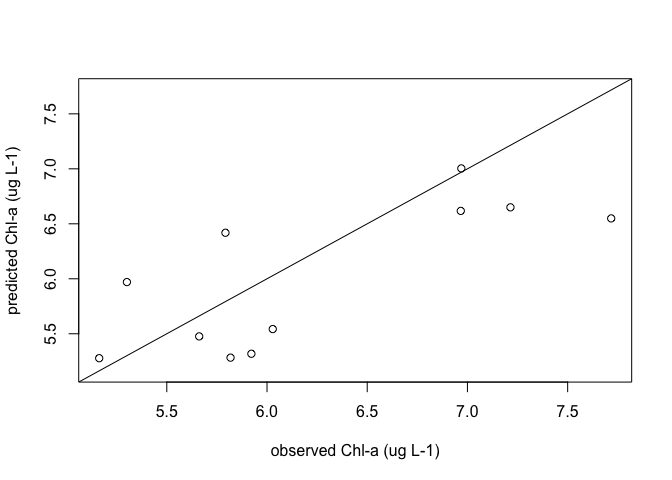<!-- -->

``` r
forecast = apply(da_frequency_experiment_output[[10]]$Y_pred[1,,] , 1, FUN = mean)

#limit obs to forecast dates
  forecast_obs <- lake_data %>%
    mutate(datetime = as.Date(datetime)) %>%
    filter(datetime %in% da_frequency_experiment_output[[10]]$dates) 
  
#calculate bias
err <- mean(forecast - forecast_obs$chla, na.rm = TRUE) 
#calculate RMSE
rmse <- sqrt(mean((forecast_obs$chla - forecast)^2, na.rm = TRUE))


#money plot of all DA frequencies vs rmse
plot_da_frequency_experiment_results(da_frequency_experiment_output,
                                     chla_assimilation_frequencies)
```

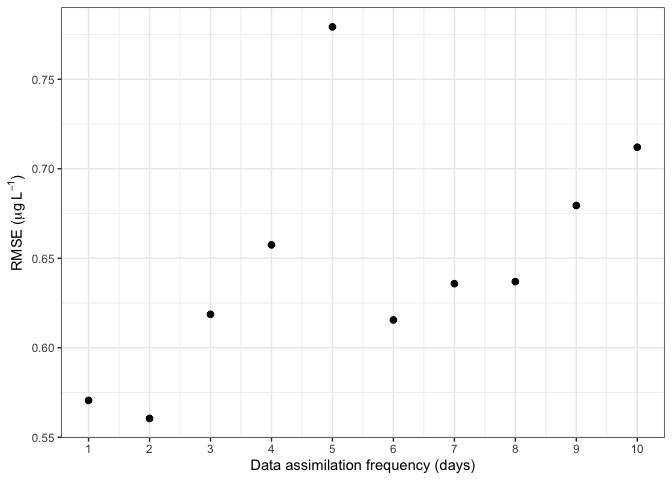<!-- -->

## 9. Assimilate data with different levels of observation uncertainty.

``` r
#set forecast horizon in days
forecast_horizon = 10

#format observation data file depending on selected frequency of data assimilation
forecast_dates <- seq.Date(from = as.Date(forecast_start_date), to = as.Date(forecast_start_date) + forecast_horizon, by = 'days')

#define observation uncertainty vector, with values both above and below empirically calculated observation uncertainty
obs_uncertainty = c(3.0, 2.5, 2.0, 1.5, 1.0, 0.75, 0.5, 0.4, 0.3, 0.2, 0.1)
  
#define chl-a assimilation frequency
chla_assimilation_frequency = 1

#create forecast data dataframe
  a <- c(1:forecast_horizon)
  b1 <- a[seq(1, length(a), chla_assimilation_frequency)]
  
  forecast_data <- lake_data %>%
    select(datetime, chla) %>%
    mutate(datetime = as.Date(datetime)) %>%
    filter(datetime %in% forecast_dates) %>%
    mutate(rownum = row_number(datetime)) %>%
    mutate(chla = ifelse(rownum %in% b1,chla,NA)) %>%
    select(-rownum)
  
n_en = 200 # how many ensemble members 


#make empty list for DA frequency experiment output
obs_uncertainty_experiment_output <- list()

for(i in 1:length(obs_uncertainty)){

#run the forecast!
obs_uncertainty_experiment_output[[i]] = run_forecasts(n_en = 200, # number of ensemble members
                          start = forecast_start_date, # start date 
                          stop = last(forecast_dates), # stop date
                          forecast_data = forecast_data, # file of observations
                          ic_sd = obs_uncertainty[i], # sd of observations
                          ic = curr_chla, # initial condition
                          model = ar_model, # forecast model
                          residuals = residuals) # residuals from model fit

names(obs_uncertainty_experiment_output)[[i]] <- paste0(obs_uncertainty[i],"_ugL")

}
```

## 10. Assess the effect of observation uncertainty on forecast accuracy.

``` r
#plot and assess weekly DA
#plot forecast output
plot_chla(est_out = obs_uncertainty_experiment_output[[1]], lake_data = lake_data, obs_file = obs_uncertainty_experiment_output[[1]]$obs_file, start = forecast_start_date, stop = last(forecast_dates), n_en = n_en)
```

    ## Warning: Removed 200 rows containing non-finite values (`stat_ydensity()`).

    ## Warning: Removed 200 rows containing missing values (`geom_point()`).

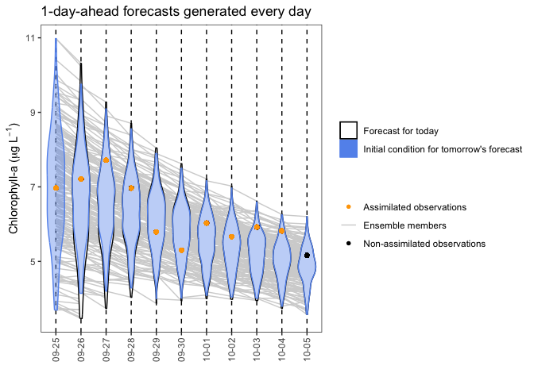<!-- -->

``` r
#assess forecast
pred_v_obs_chla(forecasts = obs_uncertainty_experiment_output[[1]], lake_data = lake_data)
```

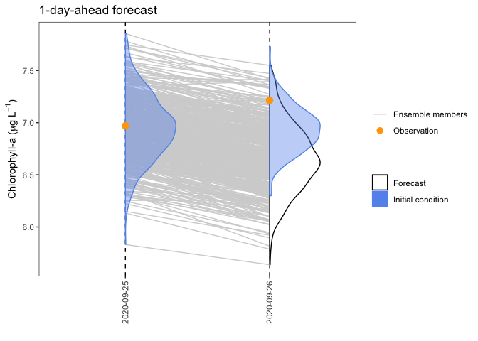<!-- -->

``` r
forecast = apply(obs_uncertainty_experiment_output[[1]]$Y_pred[1,,] , 1, FUN = mean)

#limit obs to forecast dates
  forecast_obs <- lake_data %>%
    mutate(datetime = as.Date(datetime)) %>%
    filter(datetime %in% obs_uncertainty_experiment_output[[1]]$dates) 
  
#calculate bias
err <- mean(forecast - forecast_obs$chla, na.rm = TRUE) 
#calculate RMSE
rmse <- sqrt(mean((forecast_obs$chla - forecast)^2, na.rm = TRUE))

#plot and assess daily DA
#plot forecast output
plot_chla(est_out = obs_uncertainty_experiment_output[[11]], lake_data = lake_data, obs_file = obs_uncertainty_experiment_output[[11]]$obs_file, start = forecast_start_date, stop = last(forecast_dates), n_en = n_en)
```

    ## Warning: Removed 200 rows containing non-finite values (`stat_ydensity()`).
    ## Removed 200 rows containing missing values (`geom_point()`).

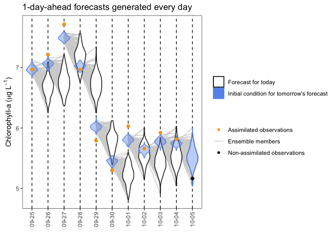<!-- -->

``` r
#assess forecast
pred_v_obs_chla(forecasts = obs_uncertainty_experiment_output[[11]], lake_data = lake_data)
```

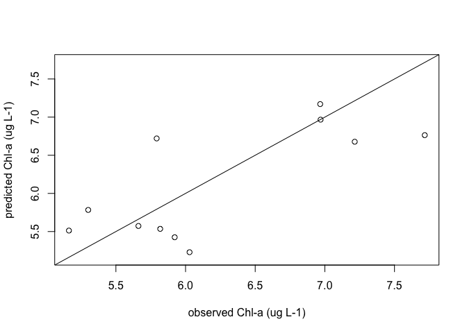<!-- -->

``` r
forecast = apply(obs_uncertainty_experiment_output[[11]]$Y_pred[1,,] , 1, FUN = mean)

#limit obs to forecast dates
  forecast_obs <- lake_data %>%
    mutate(datetime = as.Date(datetime)) %>%
    filter(datetime %in% obs_uncertainty_experiment_output[[11]]$dates) 
  
#calculate bias
err <- mean(forecast - forecast_obs$chla, na.rm = TRUE) 
#calculate RMSE
rmse <- sqrt(mean((forecast_obs$chla - forecast)^2, na.rm = TRUE))


#money plot of all DA frequencies vs rmse
plot_obs_uncertainty_experiment_results(obs_uncertainty_experiment_output,
                                     obs_uncertainty)
```

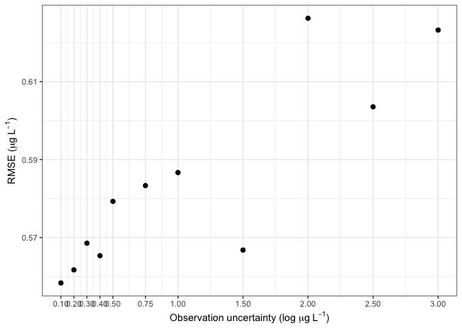<!-- -->

What is the extension activity where students are actually asked to
code?

See how DA frequency affects DO forecasts? Same model approach, same
code, students need to swap out for DO dataset? But what would students
need to choose? Maybe they choose from a suite of high-frequency
variables? So it could be DO, temp, …… fDOM? (would be good to have at
least 3 choices)

Looking at data product
<https://data.neonscience.org/data-products/DP1.20288.001>

It could be DO, pH, fDOM, turbidity pretty easily, and then they just
choose one and do the same exercise of fitting the AR model and doing DA
at different frequencies, and at the end the goal is to compare the
money plot of DA frequency vs RMSE between chl-a and whatever the second
variable was they chose and determine which one DA helps the most and
speculate as to why.
