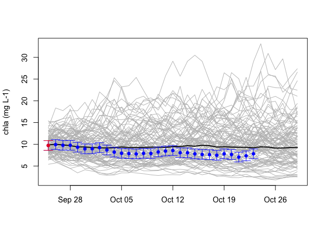
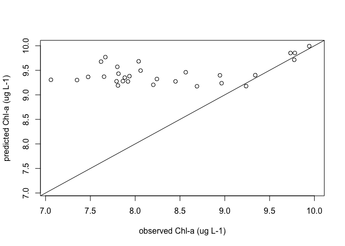
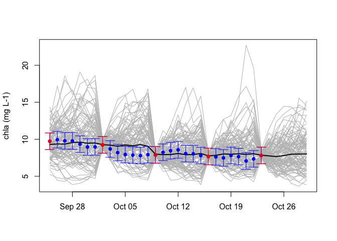
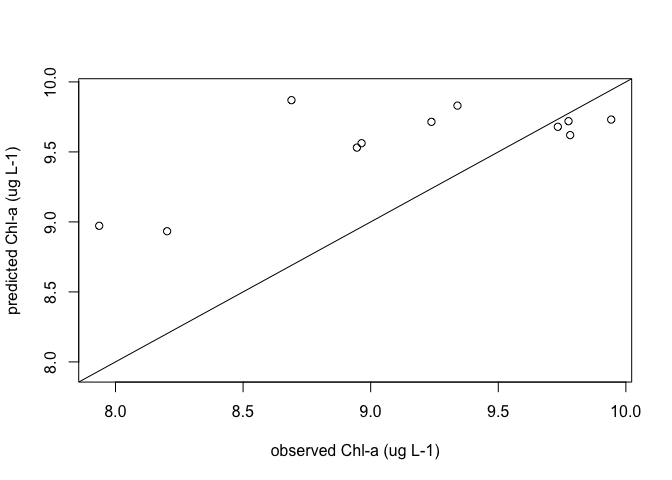
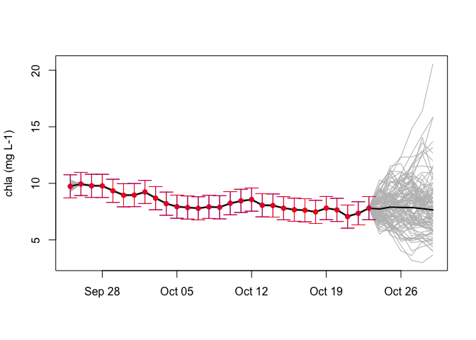
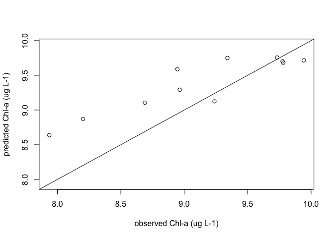
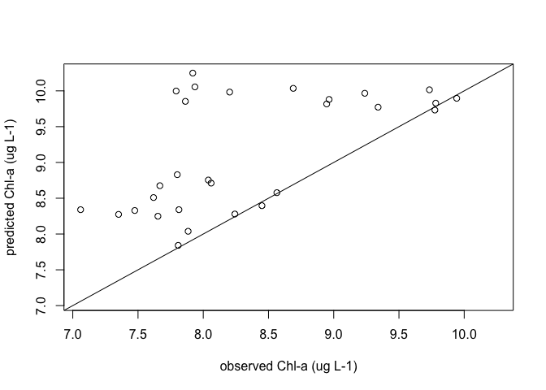
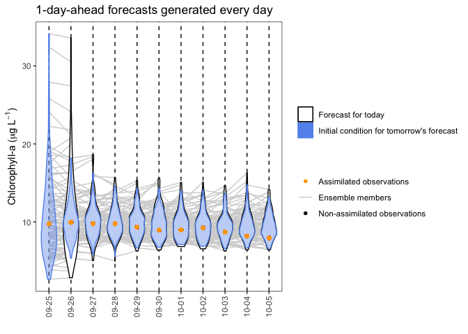
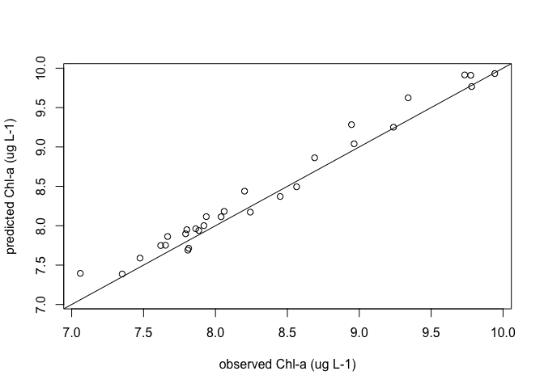

Macrosystems EDDIE Module 7: Using Data to Improve Ecological Forecasts
================
Mary Lofton, Tadhg Moore, Quinn Thomas, Cayelan Carey
2023-04-05

## Set-up (not shown)

## Define functions

### NEON data functions

#### Function to read in NEON data

``` r
# Read in NEON data ---- 
#' @param siteID character; four-letter identifier for the NEON site
#' @param var character; short name used to identify NEON variables. See "data/neon_variables.csv"
read_neon_data <- function(siteID, var) {
  idx <- which(neon_vars$Short_name == var)
  read_var <- neon_vars$id[idx]
  units <- neon_vars$units[idx]
  file <- file.path("neon", paste0(siteID, "_", read_var, "_", units, ".csv"))
  if(file.exists(file)) {
    df <- read.csv(file)
    df[, 1] <- as.POSIXct(df[, 1], tz =  "UTC")
    colnames(df)[2] <- "value"
    df$var <- neon_vars$id[idx]
    return(df)
  } else {
    stop("File: '", file, "' does not exist.")
  }
}
```

#### Function to format NEON data for input to EnKF

``` r
#' pulls in variables needed for selected site and NP model and aggregates them
#'
#' @param siteID name of NEON lake site
#' @param neon_vars table of NEON variables available at lake sites; needed because of call to nested read_neon_data function
format_enkf_inputs <- function(siteID, neon_vars){

#States
chla <- read_neon_data(siteID, "Chlorophyll-a") %>%
  rename(chla = value) %>%
  select(Date,chla) %>%
  rename(datetime = Date) %>%
  mutate(chla = log(chla + 0.001))

lake_data <- chla

return(lake_data)
}
```

#### Function to create input dataset for various frequencies of data assimilation

``` r
#' students will choose a frequency of data assimilation ranging from monthly to #' daily
#' @param freq_chla frequency of chla data assimilation in days between 1-30
#' @param freq_din frequency of din data assimilation in days between 1-30
#' @param lake_data NEON lake dataset that has been formatted using the format_enkf_inputs function
#' @param start_date start date of forecast (either 2020-09-25 or 2020-10-02)
create_data_assim_inputs <- function(freq_chla, lake_data, start_date){
  
  dates <- get_model_dates(as.Date(start_date), as.Date(start_date)+35, time_step = 'days')
  
  a <- 1:35
  b1 <- a[seq(1, length(a), freq_chla)]

  out <- lake_data %>%
    select(datetime, chla) %>%
    mutate(datetime = as.Date(datetime)) %>%
    filter(datetime %in% dates) %>%
    mutate(rownum = row_number(datetime)) %>%
    mutate(chla = ifelse(rownum %in% b1,chla,NA)) %>%
    select(-rownum)
  
  return(out)
  
}
```

#### Function to get initial conditions for forecast using formatted NEON lake data

``` r
#' specify initial conditions as either the observation from the first day of the forecast or the most recent observation
#' @param lake_data NEON lake dataset that has been formatted using the format_enkf_inputs function
#' @param start_date start date of forecast (either 2020-09-25 or 2020-10-02)
get_yini <- function(lake_data, start_date){
  
  yini <- c(NA)
  
  lake_data$datetime = as.Date(lake_data$datetime)
  closest<-function(xv, sv){
  xv[which.min(xv-sv)]}
  if(is.na(lake_data[lake_data[, "datetime"] == as.Date(start_date),"chla"])){
    startrow <- which(lake_data[, "datetime"] == as.Date(start_date))
    NotNA <- lake_data %>% 
      mutate(rownum = c(1:length(lake_data$chla))) %>% 
      filter(!is.na(chla) & datetime < start_date)
    yinirow <- which.min(abs(startrow-NotNA$rownum))
    yini[1] <- NotNA[yinirow,"chla"]
  } else {
      yini[1] <- lake_data[lake_data[, "datetime"] == as.Date(start_date),"chla"]
    }
  
  return(yini)
}
```

### AR model functions

#### Function to fit AR model

``` r
# Fit AR model
fit_AR_model <- function(lake_data, start_date){
  
  ar.data <- lake_data %>%
    filter(datetime < start_date) %>%
    mutate(chla = na.approx(chla, na.rm = F)) %>% 
    filter(!is.na(chla)) %>%
    mutate(chla_lag = lag(chla))
  
  ar.model <- ar.ols(ar.data$chla, order.max = 1, aic = FALSE,
                     intercept = TRUE, demean = TRUE)
  
  return(list(ar1 = ar.model$ar, mean = ar.model$x.mean, intercept = ar.model$x.intercept))
}
```

#### Function to predict with AR model

``` r
pred_AR_model <- function(mod, chla){
  
  c = mod$intercept
  ar1 = mod$ar1
  chla_mean = mod$mean
  
  chla_pred <- c + ar1 * (chla - chla_mean) + chla_mean
  
  return(list(chla_pred = chla_pred,
              c = c,
              ar1 = ar1,
              chla_mean = chla_mean))
}
```

### ENKF functions from Jake Zwart GLEON workshop

#### Function to create vector of model timesteps

``` r
#' retreive the model time steps based on start and stop dates and time step
#'
#' @param model_start model start date in date class
#' @param model_stop model stop date in date class
#' @param time_step model time step, defaults to daily timestep
get_model_dates = function(model_start, model_stop, time_step = 'days'){
  
  model_dates = seq.Date(from = as.Date(model_start), to = as.Date(model_stop), by = time_step)
  
  return(model_dates)
}
```

#### Function to create vector to hold states and parameters for updating

``` r
#' vector for holding states and parameters for updating
#'
#' @param n_states number of states we're updating in data assimilation routine
#' @param n_params_est number of parameters we're calibrating
#' @param n_step number of model timesteps
#' @param n_en number of ensembles
get_Y_vector = function(n_states, n_params_est, n_step, n_en){
  
  Y_ic = array(dim = c(n_states + n_params_est, n_step, n_en))
  Y_pred = array(dim = c(n_states + n_params_est, n_step, n_en))
  
  return(list(Y_ic = Y_ic, Y_pred = Y_pred))
}
```

#### Function to create observation error matrix

``` r
#' observation error matrix, should be a square matrix where
#'   col & row = the number of states and params for which you have observations
#'
#' @param n_states number of states we're updating in data assimilation routine
#' @param n_param_obs number of parameters for which we have observations
#' @param n_step number of model timesteps
#' @param state_sd vector of state observation standard deviation; assuming sd is constant through time
#' @param param_sd vector of parameter observation standard deviation; assuming sd is constant through time
get_obs_error_matrix = function(n_states, n_params_obs, n_step, state_sd, param_sd){
  
  R = array(0, dim = c(n_states + n_params_obs, n_states + n_params_obs, n_step))
  
  state_var = state_sd^2 #variance of temperature observations
  
  param_var = param_sd^2
  
  if(n_params_obs > 0){
    all_var = c(state_var, param_var)
  }else{
    all_var = state_var
  }
  
  for(i in 1:n_step){
    # variance is the same for each depth and time step; could make dynamic or varying by time step if we have good reason to do so
    R[,,i] = diag(all_var, n_states + n_params_obs, n_states + n_params_obs)
  }
  
  return(R)
}
```

#### Function to create matrix that identifies when observations are available

``` r
#' Measurement operator matrix saying 1 if there is observation data available, 0 otherwise
#'
#' @param n_states number of states we're updating in data assimilation routine
#' @param n_param_obs number of parameters for which we have observations
#' @param n_params_est number of parameters we're calibrating
#' @param n_step number of model timesteps
#' @param obs observation matrix created with get_obs_matrix function
get_obs_id_matrix = function(n_states, n_params_obs, n_params_est, n_step, obs){
  
  H = array(0, dim=c(n_states + n_params_obs, n_states + n_params_est, n_step))
  
  # order goes 1) states, 2)params for which we have obs, 3) params for which we're estimating but don't have obs
  
  for(t in 1:n_step){
    H[1:(n_states + n_params_obs), 1:(n_states + n_params_obs), t] = diag(ifelse(is.na(obs[,,t]),0, 1), n_states + n_params_obs, n_states + n_params_obs)
  }
  
  return(H)
}
```

#### Function to turn observation dataframe into matrix

``` r
#' turn observation dataframe into matrix
#'
#' @param obs_df observation data frame
#' @param model_dates dates over which you're modeling
#' @param n_step number of model time steps
#' @param n_states number of states we're updating in data assimilation routine
#' @param states character string vector of state names in obs_file
get_obs_matrix = function(obs_df, model_dates, n_step, n_states, states){
  
  # need to know location and time of observation
  
  obs_df_filtered = obs_df %>%
    dplyr::filter(as.Date(datetime) %in% model_dates) %>%
    mutate(date = as.Date(datetime)) %>%
    select(date, chla) %>%
    mutate(date_step = which(model_dates %in% date))
  obs_matrix = array(NA, dim = c(n_states, 1, n_step))
  for(i in 1:n_states){
  for(j in obs_df_filtered$date_step){
    obs_matrix[i, 1, j] = dplyr::filter(obs_df_filtered,
                                        date_step == j) %>%
      pull(states[i])
  }}
  
  return(obs_matrix)
}
```

#### Kalman filter function

``` r
##' @param Y vector for holding states and parameters you're estimating
##' @param R observation error matrix
##' @param obs observations at current timestep
##' @param H observation identity matrix
##' @param n_en number of ensembles
##' @param cur_step current model timestep
kalman_filter = function(Y, R, obs, H, n_en, cur_step){
  
  cur_obs = obs[ , , cur_step]
  
  cur_obs = ifelse(is.na(cur_obs), 0, cur_obs) # setting NA's to zero so there is no 'error' when compared to estimated states
  
  ###### estimate the spread of your ensembles #####
  Y_mean = matrix(apply(Y[ , cur_step, ], MARGIN = 1, FUN = mean), nrow = length(Y[ , 1, 1])) # calculating the mean of each temp and parameter estimate
  delta_Y = Y[ , cur_step, ] - matrix(rep(Y_mean, n_en), nrow = length(Y[ , 1, 1])) # difference in ensemble state/parameter and mean of all ensemble states/parameters
  
  ###### estimate Kalman gain #########
  K = ((1 / (n_en - 1)) * delta_Y %*% t(delta_Y) %*% matrix(t(H[, , cur_step]))) %*%
    qr.solve(((1 / (n_en - 1)) * H[, , cur_step] %*% delta_Y %*% t(delta_Y) %*% matrix(t(H[, , cur_step])) + R[, , cur_step]))
  
  ###### update Y vector ######
  for(q in 1:n_en){
    Y[, cur_step, q] = Y[, cur_step, q] + K %*% (cur_obs - H[, , cur_step] %*% Y[, cur_step, q]) # adjusting each ensemble using kalman gain and observations
  }
  return(Y)
}
```

#### Function to initialize state and parameter vector

``` r
#' initialize Y vector with draws from distribution of obs
#'
#' @param Y Y vector
#' @param obs observation matrix
initialize_Y = function(Y, obs, init_params, n_states_est, n_params_est, n_params_obs, n_step, n_en, state_sd, param_sd, yini){
  
  # initializing states with earliest observations and parameters
  first_obs = yini #%>% # turning array into list, then using coalesce to find first obs in each position.
    #ifelse(is.na(.), mean(., na.rm = T), .) # setting initial temp state to mean of earliest temp obs from other sites if no obs
  #MEL omitting this for now - can build back in later if needed
  
  if(n_params_est > 0){
    first_params = init_params
  }else{
    first_params = NULL
  }
  
  Y$Y_ic[ , 1, ] = array(abs(rnorm(n = n_en * (n_states_est + n_params_est),
                              mean = c(first_obs, first_params),
                              sd = c(state_sd, param_sd))),
                    dim = c(c(n_states_est + n_params_est), n_en))
  
  Y$Y_pred[ , 1, ] = array(abs(rnorm(n = n_en * (n_states_est + n_params_est),
                              mean = c(first_obs, first_params),
                              sd = c(state_sd, param_sd))),
                    dim = c(c(n_states_est + n_params_est), n_en))
  
  return(Y)
}
```

#### EnKF wrapper

``` r
#' wrapper for running EnKF 
#' 
#' @param n_en number of model ensembles 
#' @param start start date of model run 
#' @param stop date of model run
#' @param time_step model time step, defaults to days 
#' @param obs_file observation file 
#' @param n_states_est number of states we're estimating 
#' @param n_params_est number of parameters we're estimating 
#' @param n_params_obs number of parameters for which we have observations
#' @param param_init vector of initial parameter values 
#' @param obs_cv coefficient of variation of observations 
#' @param param_cv coefficient of variation of parameters 
#' @param init_cond_cv initial condition CV 
#' @param state_names character string vector of state names as specified in obs_file
#' @param yini vector of initial conditions for states (chla, din)
EnKF = function(n_en = 30, 
                start = '2020-09-25', # start date 
                stop = '2020-10-29', 
                time_step = 'days', 
                obs_file = lake_data,
                n_states_est = 1, 
                n_params_est = 3,
                n_params_obs = 0, 
                param_init = c(mod$intercept, mod$ar1, mod$mean), 
                obs_cv = c(0.1),
                param_cv = c(0.1, 0.1, 0.1),
                init_cond_cv = c(0.1),
                state_names = c("chla"),
                yini = yini){
  
  
  n_en = n_en
  start = as.Date(start)
  stop = as.Date(stop)
  time_step = 'days' 
  dates = get_model_dates(model_start = start, model_stop = stop, time_step = time_step)
  n_step = length(dates)
  
  # get observation matrix
  obs_df = obs_file %>% 
    select(datetime, chla) 
  
  n_states_est = n_states_est # number of states we're estimating 
  
  n_params_est = n_params_est # number of parameters we're calibrating
  
  n_params_obs = n_params_obs # number of parameters for which we have observations
  
  param_init = param_init # Initial estimate of DOC decay rate day^-1 
  
  yini <- c( #initial estimate of PHYTO and DIN states, respectively
  chla = yini[1]) #ug/L
  
  state_cv = obs_cv #coefficient of variation of chla and din observations, respectively 
  state_sd = state_cv * yini
  init_cond_sd = init_cond_cv * yini
  
  param_cv = param_cv #coefficient of variation of maxUptake 
  param_sd = abs(param_cv * param_init)
  
  # setting up matrices
  # observations as matrix
  obs = get_obs_matrix(obs_df = obs_df,
                       model_dates = dates,
                       n_step = n_step,
                       n_states = n_states_est,
                       states = state_names)
  
  # Y vector for storing state / param estimates and updates
  Y = get_Y_vector(n_states = n_states_est,
                   n_params_est = n_params_est,
                   n_step = n_step,
                   n_en = n_en)
  Y_ic = Y$Y_ic
  Y_pred = Y$Y_pred
  
  # observation error matrix
  R = get_obs_error_matrix(n_states = n_states_est,
                           n_params_obs = n_params_obs,
                           n_step = n_step,
                           state_sd = state_sd,
                           param_sd = param_sd)
  
  # observation identity matrix
  H = get_obs_id_matrix(n_states = n_states_est,
                        n_params_obs = n_params_obs,
                        n_params_est = n_params_est,
                        n_step = n_step,
                        obs = obs)
  
  # initialize Y vector
  Y = initialize_Y(Y = Y, obs = obs, init_params = param_init, n_states_est = n_states_est,
                   n_params_est = n_params_est, n_params_obs = n_params_obs,
                   n_step = n_step, n_en = n_en, state_sd = init_cond_sd, param_sd = param_sd, yini = yini)
  Y_ic = Y$Y_ic
  Y_pred = Y$Y_pred
  
  
  # start modeling
  for(t in 2:n_step){
    for(n in 1:n_en){
      
      # run model; 
      model_output = pred_AR_model(mod = mod, 
                              chla = Y_ic[1, t-1, n])
      
      ######quick hack to add in process error (ha!)########
      
      #specify Y_star (mean of multivariate normal)
      Y_star = matrix(c(model_output$chla_pred, model_output$c, model_output$ar1,
                        model_output$chla_mean))
      
      #specify sigma (covariance matrix of states and updating parameters)
      residual_matrix <- matrix(NA, nrow = 4, ncol = 4)
      residual_matrix[1,] <- c(0.03, 0.01, 0.01, 0.01)
      residual_matrix[2,] <- c(0.07, 0.02, 0.02, 0.02)
      residual_matrix[3,] <- c(0.11, 0.03, 0.03, 0.03)
      residual_matrix[4,] <- c(-0.11, -0.03, -0.03, -0.03)
      sigma_proc <- cov(residual_matrix)
      
      #make a draw from Y_star
      Y_draw = abs(rmvnorm(1, mean = Y_star, sigma = sigma_proc))
      Y_ic[1 , t, n] = Y_draw[1] # store in Y vector
      Y_ic[2 , t, n] = Y_draw[2]
      Y_ic[3 , t, n] = Y_draw[3]
      Y_ic[4 , t, n] = Y_draw[4]
      
      Y_pred[1 , t, n] = Y_draw[1] # store in Y vector
      Y_pred[2 , t, n] = Y_draw[2]
      Y_pred[3 , t, n] = Y_draw[3]
      Y_pred[4 , t, n] = Y_draw[4]
      
      #####end of hack######################################
      
    }
    # check if there are any observations to assimilate 
    if(any(!is.na(obs[ , , t]))){
      Y_ic = kalman_filter(Y = Y_ic,
                        R = R,
                        obs = obs,
                        H = H,
                        n_en = n_en,
                        cur_step = t) # updating params / states if obs available
    }
  }
  out = list(Y_ic = Y_ic, Y_pred = Y_pred, dates = dates, R = R, obs = obs, state_sd = state_sd)
  
  return(out)
}
```

#### Function to calculate RMSE

``` r
#' calculate RMSE of ensemble mean vs. observations 
#' 
#' @param est_out forecast output from EnKF wrapper 
#' @param lake_data NEON data for selected site formatted using format_enkf_inputs function
rmse <- function(est_out, lake_data){
  
  #get ensemble mean
  mean_chla_est = exp(apply(est_out$Y_pred[1,,] , 1, FUN = mean))

  #limit obs to forecast dates
  lake_data1 <- lake_data %>%
    mutate(datetime = as.Date(datetime),
           chla = exp(chla)) %>%
    filter(datetime %in% est_out$dates) 
  
  #calculate RMSE
  rmse_chla <- sqrt(mean((lake_data1$chla - mean_chla_est)^2, na.rm = TRUE))

  return(list(rmse_chla = rmse_chla))
}
```

### Plotting functions

#### Functions to plot chl-a forecast

``` r
#' plot chlorophyll forecast and observations 
#' 
#' @param est_out forecast output from EnKF wrapper 
#' @param lake_data NEON data for selected site formatted using format_enkf_inputs function
#' @param start start date
#' @param stop stop date
#' @param n_en number of ensemble members
#' @param layers specified which layers to plot (fc_violin, ic_violin, ensemble, obs_assim, obs_not_assim)
#' @param days_to_plot how many days to plot? range from 1 to end of forecast period
#' 
plot_chla = function(est_out, lake_data, obs_file, start, stop, n_en){
  
  plot_dates <- get_model_dates(model_start = start,
                                          model_stop = stop,
                                          time_step = "days")

  assim_data <- obs_file %>%
    rename(obs_assimilated = chla) %>%
    # mutate(assim_key1 = ifelse(!is.na(obs_assimilated) | !is.na(lag(obs_assimilated)), 1, 0),
    #        assim_key2 = ifelse(!is.na(obs_assimilated) | !is.na(lead(obs_assimilated)), 1, 0),
    #        assim_key3 = ifelse(!is.na(obs_assimilated), 1, 0),
    #        obs_assimilated = exp(obs_assimilated))
    mutate(assim_key1 = ifelse(!is.na(obs_assimilated), 1, 0),
           assim_key2 = ifelse(!is.na(lag(obs_assimilated)), 1, 0),
           obs_assimilated = exp(obs_assimilated))
  
  chla_pred = NULL
  chla_ic = NULL
  for(i in 1:length(plot_dates)){
    chla_pred <- c(chla_pred, exp(est_out$Y_pred[1,i,]))
    chla_ic <- c(chla_ic, exp(est_out$Y_ic[1,i,]))
  }
  
  plot_data <- tibble(datetime = rep(plot_dates, each = n_en),
                   ensemble_member = rep(1:n_en, times = length(plot_dates)),
                   chla_pred = chla_pred,
                   chla_ic = chla_ic) %>%
    left_join(., lake_data, by = "datetime") %>%
    left_join(., assim_data, by = "datetime")
  
  plot_data2 <- plot_data %>%
    add_column(datefactor = as.factor(format(as.Date(plot_data$datetime), "%m-%d"))) %>%
    mutate(chla = exp(chla),
           chla_fc = ifelse(datefactor == "09-25", NA, chla_pred))
  
  ens <- plot_data2 %>%
    select(datetime, ensemble_member)
  
  for(d in 1:(length(plot_dates)-1)){
    
    obs <- obs_file %>% filter(datetime == plot_dates[d])
    
    if(!is.na(obs$chla)){
      
      ic <- plot_data2 %>%
        filter(datetime == ymd(plot_dates[d])) %>%
        pull(chla_ic)
      
      pred <- plot_data2 %>%
        filter(datetime == ymd(plot_dates[d])+1) %>%
        pull(chla_pred)
      
      temp <- tibble(datetime = rep(seq(from = ymd(plot_dates[d]), to = ymd(plot_dates[d])+1, by = "day"), each = n_en),
                     ensemble_member = rep(1:n_en, times = 2),
                     chla_ens_today = c(ic, pred))
      
      newName <- setNames("chla_ens_today", paste0("chla_ens_",plot_dates[d]))

      ens <- ens %>%
        left_join(., temp, by = c("datetime","ensemble_member")) %>%
        rename(all_of(newName))
    } else {
      ic <- plot_data2 %>%
        filter(datetime == ymd(plot_dates[d])) %>%
        pull(chla_pred)
      
      pred <- plot_data2 %>%
        filter(datetime == ymd(plot_dates[d])+1) %>%
        pull(chla_pred)
      
      temp <- tibble(datetime = rep(seq(from = ymd(plot_dates[d]), to = ymd(plot_dates[d])+1, by = "day"), each = n_en),
                     ensemble_member = rep(1:n_en, times = 2),
                     chla_ens_today = c(ic, pred))
      
      newName <- setNames("chla_ens_today", paste0("chla_ens_",plot_dates[d]))

      ens <- ens %>%
        left_join(., temp, by = c("datetime","ensemble_member")) %>%
        rename(all_of(newName))
    }
      
  }
  
  ens <- ens %>%
    add_column(datefactor = as.factor(format(as.Date(plot_data$datetime), "%m-%d"))) %>%
    pivot_longer(cols = -c(datetime, ensemble_member, datefactor), names_to = "ensemble_date",
                 values_to = "ens")  %>%
    filter(complete.cases(.)) 
    
  p <- ggplot()+
    geom_line(data = ens, aes(x = datefactor, y = ens, group = interaction(ensemble_date, ensemble_member), color = "Ensemble members"))+
    geom_violin(data = plot_data2, aes(x = datefactor, y = chla_fc, fill = "Forecast for today"), color = "black",
                scale = "width", width = 0.7)+
    geom_violin(data = plot_data2, aes(x = datefactor, y = chla_ic, fill = "Initial condition for tomorrow's forecast"), color = "cornflowerblue", alpha = 0.4, scale = "width", width = 0.7)+
    geom_point(data = plot_data2, aes(x = datefactor, y = chla, color = "Non-assimilated observations"))+
    geom_point(data = plot_data2, aes(x = datefactor, y = obs_assimilated, color = "Assimilated observations"))+
    ylab(expression(paste("Chlorophyll-a (",mu,g,~L^-1,")")))+
    xlab("")+
    theme_bw()+
    theme(panel.grid.major.x = element_line(colour = "black", linetype = "dashed"),
          panel.grid.major.y = element_blank(),
          panel.grid.minor.y = element_blank(),
          axis.text.x = element_text(angle = 90, vjust = 0.5, hjust=1))+
    scale_color_manual(values = c("Ensemble members" = "lightgray",
                                  "Non-assimilated observations" = "black",
                                  "Assimilated observations" = "orange"), 
                       name = "",
                       guide = guide_legend(override.aes = list(
                         linetype = c("blank","solid","blank"),
                         shape = c(16,NA, 16))))+
    scale_fill_manual(values = c("Forecast for today" = "white", "Initial condition for tomorrow's forecast" = "cornflowerblue"),
                      name = "",
                      guide = guide_legend(override.aes = list(
                         color = c("black","cornflowerblue"))))+
    ggtitle("1-day-ahead forecasts generated every day")
  
  return(p)
}
```

#### Function to plot predictions vs. observations for chl-a

``` r
#' plot chl-a mean forecast and observations 
#' 
#' @param est_out forecast output from EnKF wrapper 
#' @param lake_data NEON data for selected site formatted using format_enkf_inputs function
pred_v_obs_chla = function(est_out, lake_data){
  mean_chla_est = exp(apply(est_out$Y_pred[1,,] , 1, FUN = mean))
  
  # this could be used to show a 95% confidence error bar on predicted
  # but I think the error bars make the plot a bit hard to read
  # top_din_est = apply(est_out$Y[2,,] , 1, FUN = quantile, probs=c(0.975))
  # bottom_din_est = apply(est_out$Y[2,,] , 1, FUN = quantile, probs=c(0.025))
  lake_data <- lake_data %>%
    mutate(datetime = as.Date(datetime)) %>%
    filter(datetime %in% est_out$dates) %>%
    mutate(chla = exp(chla))
  plot(mean_chla_est ~ lake_data$chla, type ='p', 
       ylim = c(min(c(range(mean_chla_est,na.rm = TRUE),range(lake_data$chla,na.rm = TRUE))),c(max(c(range(mean_chla_est,na.rm = TRUE),range(lake_data$chla,na.rm = TRUE))))),
       xlim = c(min(c(range(mean_chla_est,na.rm = TRUE),range(lake_data$chla,na.rm = TRUE))),c(max(c(range(mean_chla_est,na.rm = TRUE),range(lake_data$chla,na.rm = TRUE))))),
       col = 'black', ylab = 'predicted Chl-a (ug L-1)', xlab = 'observed Chl-a (ug L-1)')
  abline(a=0, b=1)
  
  #this code could be used to show error bars representing uncertainty but 
  #I think it makes the plot kinda hard to read
  # arrows(lake_data$din[1:35]  - est_out$state_sd[2], mean_din_est,
  #        lake_data$din[1:35]  + est_out$state_sd[2], mean_din_est, 
  #        code = 3, length = 0.1, angle = 90, col = 'black')
  # arrows(lake_data$din, mean_din_est  - est_out$state_sd[2], 
  #        lake_data$din, mean_din_est  + est_out$state_sd[2], 
  #        code = 3, length = 0.1, angle = 90, col = 'black')
}
```

## Objective 7: Assimilate data

This objective introducees students to data assimilation by asking
students to generate multiple sequential 1-day-ahead forecasts:  
A. using initial conditions based on the most recent chl-a observations
but no subsequent data assimilation  
B. that assimilate chl-a data at a weekly frequency

The desired learning outcome is for students to understand that data
assimilation corrects 1-day-ahead model predictions and improves
forecast performance as assessed by RMSE calculated for the mean
ensemble prediction and observations.

### Set-up

``` r
# Load in NEON sites dataframe ----
neon_sites_df <- read.csv("./neon_sites.csv") %>%
  filter(type == "Aquatic")
neon_sites_df$long <- round(neon_sites_df$long, 3)
neon_sites_df$lat <- round(neon_sites_df$lat, 3)
# Reference for downloading variables ----
neon_vars <- read.csv("./neon_variables.csv")
# Objective 1 - Site Selection ----
print(neon_sites_df$siteID)
```

    ## [1] "CRAM" "SUGG" "BARC" "PRPO" "LIRO" "PRLA" "TOOK"

``` r
#we have BARC, CRAM, LIRO, PRLA, PRPO, SUGG, TOOK
#need to think about which sites we want to use for Mod 7 based on how they behave in app testing
siteID <- "PRPO"
#set start date of forecast
start_date = "2020-09-25" 
#load NEON data and format for input into EnKF
lake_data <- format_enkf_inputs(siteID = siteID, neon_vars = neon_vars)
```

    ## Warning in log(chla + 0.001): NaNs produced

``` r
#get initial conditions for forecast
yini <- get_yini(lake_data = lake_data,
                 start_date = start_date)
#fit AR model
mod <- fit_AR_model(lake_data = lake_data,
                    start_date = start_date)
```

### Run forecast with no data assimilation

In this case, inserting 36 as the frequency of chl-a assimilation
ensures that only the first observation in the 35 day observation period
will be assimilated. If there are no chl-a data available on the start
date of the forecast, the get_yini function will pull in the most recent
observation prior to the forecast start date as the initial condition
for that variable.

``` r
#format observation data file depending on selected frequency of data assimilation
obs_file <- create_data_assim_inputs(freq_chla = 11,
                                     lake_data = lake_data,
                                     start_date = start_date)
n_en = 100 # how many ensemble members 
#run the forecast!
est_out = EnKF(n_en = n_en, 
           start = '2020-09-25', # start date 
           stop = '2020-10-05', # stop date
           time_step = 'days',
           obs_file = obs_file,
           n_states_est = 1, 
           n_params_est = 3,
           n_params_obs = 0,
           param_init = c(mod$intercept, mod$ar1, mod$mean), 
           obs_cv = c(0.05),#cv for chl-a 
           param_cv = c(0.1, 0.1, 0.1),#for mod params
           init_cond_cv = c(0.05),#cv for chl-a 
           state_names = c("chla"),
           yini = yini)
#plot forecast output
plot_chla(est_out = est_out, lake_data = lake_data, obs_file = obs_file, start = "2020-09-25", stop = "2020-10-05", n_en = n_en) 
```

    ## Warning: Removed 100 rows containing non-finite values (`stat_ydensity()`).

    ## Warning: Removed 1000 rows containing missing values (`geom_point()`).

<!-- -->

``` r
pred_v_obs_chla(est_out = est_out, lake_data = lake_data)
```

<!-- -->

``` r
rmse(est_out = est_out, lake_data = lake_data)
```

    ## $rmse_chla
    ## [1] 1.149247

### Run forecast with chl-a data assimilated every week

Notice that the freq_chla argument in the create_data_assim_inputs file
has been adjusted to 7. If chl-a data is not available on the 7th, 14th,
21st…. days, the value for that day will be NA and the forecast function
will proceed without assimilating chl-a data for that day.

``` r
#format observation data file depending on selected frequency of data assimilation
obs_file <- create_data_assim_inputs(freq_chla = 4,
                                     lake_data = lake_data,
                                     start_date = start_date)
n_en = 100 # how many ensemble members 
#run the forecast!
est_out = EnKF(n_en = n_en, 
           start = '2020-09-25', # start date 
           stop = '2020-10-05', # stop date
           time_step = 'days',
           obs_file = obs_file,
           n_states_est = 1, 
           n_params_est = 3,
           n_params_obs = 0,
           param_init = c(mod$intercept, mod$ar1, mod$mean), 
           obs_cv = c(0.05),#cv for chl-a 
           param_cv = c(0.1, 0.1, 0.1),#for mod params
           init_cond_cv = c(0.05),#cv for chl-a 
           state_names = c("chla"),
           yini = yini)
#plot forecast output
plot_chla(est_out = est_out, lake_data = lake_data, start = "2020-09-25", stop = "2020-10-05", n_en = n_en, obs_file = obs_file) 
```

    ## Warning: Removed 100 rows containing non-finite values (`stat_ydensity()`).

    ## Warning: Removed 800 rows containing missing values (`geom_point()`).

<!-- -->

``` r
pred_v_obs_chla(est_out = est_out, lake_data = lake_data)
```

<!-- -->

``` r
rmse(est_out = est_out, lake_data = lake_data)
```

    ## $rmse_chla
    ## [1] 0.6211738

## Objective 8: Explore data frequency

This objective asks students to adjust the observation frequency (and
therefore the assimilation frequency) of chl-a data. The learning
outcome of the objective is for students to understand that more
frequent data assimilation may permit for more accurate forecasts, as
models closely track real-world conditions. Below are two examples: one
where chla is assimilated low frequency (every 7 days) and one where
chl-a is assimilated at high frequency (daily).

### Low chl-a assimilation frequency

``` r
#format observation data file depending on selected frequency of data assimilation
obs_file <- create_data_assim_inputs(freq_chla = 7,
                                     lake_data = lake_data,
                                     start_date = start_date)
n_en = 100 # how many ensemble members 
#run the forecast!
est_out = EnKF(n_en = n_en, 
           start = '2020-09-25', # start date 
           stop = '2020-10-05', # stop date
           time_step = 'days',
           obs_file = obs_file,
           n_states_est = 1, 
           n_params_est = 3,
           n_params_obs = 0,
           param_init = c(mod$intercept, mod$ar1, mod$mean), 
           obs_cv = c(0.05),#cv for chl-a 
           param_cv = c(0.1, 0.1, 0.1),#for mod params
           init_cond_cv = c(0.05),#cv for chl-a 
           state_names = c("chla"),
           yini = yini)
#plot forecast output
plot_chla(est_out = est_out, lake_data = lake_data, start = "2020-09-25", stop = "2020-10-05", n_en = n_en, obs_file = obs_file) 
```

    ## Warning: Removed 100 rows containing non-finite values (`stat_ydensity()`).

    ## Warning: Removed 900 rows containing missing values (`geom_point()`).

<!-- -->

``` r
pred_v_obs_chla(est_out = est_out, lake_data = lake_data)
```

<!-- -->

``` r
rmse(est_out = est_out, lake_data = lake_data)
```

    ## $rmse_chla
    ## [1] 0.6122933

### High chl-a assimilation frequency

``` r
#format observation data file depending on selected frequency of data assimilation
obs_file <- create_data_assim_inputs(freq_chla = 1,
                                     lake_data = lake_data,
                                     start_date = start_date)
n_en = 100 # how many ensemble members 
#run the forecast!
est_out = EnKF(n_en = n_en, 
           start = '2020-09-25', # start date 
           stop = '2020-10-05', # stop date
           time_step = 'days',
           obs_file = obs_file,
           n_states_est = 1, 
           n_params_est = 3,
           n_params_obs = 0,
           param_init = c(mod$intercept, mod$ar1, mod$mean), 
           obs_cv = c(0.05),#cv for chl-a 
           param_cv = c(0.1, 0.1, 0.1),#for mod params
           init_cond_cv = c(0.05),#cv for chl-a 
           state_names = c("chla"),
           yini = yini)
#plot forecast output
plot_chla(est_out = est_out, lake_data = lake_data, start = "2020-09-25", stop = "2020-10-05", n_en = n_en, obs_file = obs_file) 
```

    ## Warning: Removed 100 rows containing non-finite values (`stat_ydensity()`).

<!-- -->

``` r
pred_v_obs_chla(est_out = est_out, lake_data = lake_data)
```

<!-- -->

``` r
rmse(est_out = est_out, lake_data = lake_data)
```

    ## $rmse_chla
    ## [1] 0.4132794

## Objective 9: Explore observation uncertainty

This objective will ask students to adjust the observation uncertainty
associated with chl-a and nitrate data. The learning outcome of the
objective is for students to understand that the amount of uncertainty
associated with observations determines how much the model corrects
itself to align with those observations. Below are two examples: one
when observation uncertainty for both variables is low, and one when it
is high.

### Low observation uncertainty

``` r
#format observation data file depending on selected frequency of data assimilation
obs_file <- create_data_assim_inputs(freq_chla = 1,
                                     lake_data = lake_data,
                                     start_date = start_date)
#run the forecast!
est_out = EnKF(n_en = n_en, 
           start = '2020-09-25', # start date 
           stop = '2020-10-05', # stop date
           time_step = 'days',
           obs_file = obs_file,
           n_states_est = 1, 
           n_params_est = 3,
           n_params_obs = 0,
           param_init = c(mod$intercept, mod$ar1, mod$mean), 
           obs_cv = c(0.01),#cv for chl-a 
           param_cv = c(0.1, 0.1, 0.1),#for mod params
           init_cond_cv = c(0.01),#cv for chl-a 
           state_names = c("chla"),
           yini = yini)
#plot forecast output
plot_chla(est_out = est_out, lake_data = lake_data, start = "2020-09-25", stop = "2020-10-05", n_en = n_en, obs_file = obs_file) 
```

    ## Warning: Removed 100 rows containing non-finite values (`stat_ydensity()`).

<!-- -->

``` r
pred_v_obs_chla(est_out = est_out, lake_data = lake_data)
```

<!-- -->

``` r
rmse(est_out = est_out, lake_data = lake_data)
```

    ## $rmse_chla
    ## [1] 0.3282424

### High observation uncertainty

``` r
#format observation data file depending on selected frequency of data assimilation
obs_file <- create_data_assim_inputs(freq_chla = 1,
                                     lake_data = lake_data,
                                     start_date = start_date)
#run the forecast!
est_out = EnKF(n_en = n_en, 
           start = '2020-09-25', # start date 
           stop = '2020-10-29', # stop date
           time_step = 'days',
           obs_file = obs_file,
           n_states_est = 1, 
           n_params_est = 3,
           n_params_obs = 0,
           param_init = c(mod$intercept, mod$ar1, mod$mean), 
           obs_cv = c(0.2),#cv for chl-a 
           param_cv = c(0.1, 0.1, 0.1),#for mod params
           init_cond_cv = c(0.2),#cv for chl-a 
           state_names = c("chla"),
           yini = yini)
#plot forecast output
plot_chla(est_out = est_out, lake_data = lake_data, start = "2020-09-25", stop = "2020-10-05", n_en = n_en, obs_file = obs_file) 
```

    ## Warning: Removed 100 rows containing non-finite values (`stat_ydensity()`).

<!-- -->

``` r
pred_v_obs_chla(est_out = est_out, lake_data = lake_data)
```

<!-- -->

``` r
rmse(est_out = est_out, lake_data = lake_data)
```

    ## $rmse_chla
    ## [1] 0.8137359

Footer
